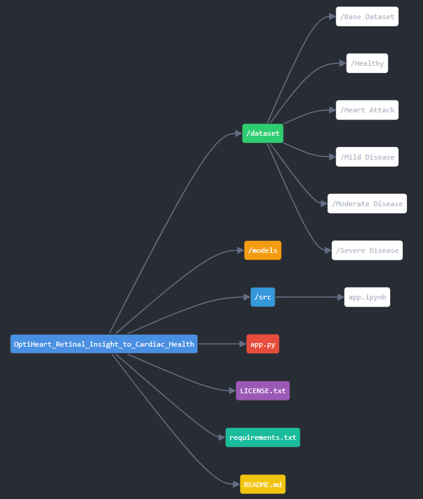

# OptiHeart Retinal Insight to Cardiac Health

This repository contains an advanced machine learning solution for heart disease prediction and retinal image analysis. The app provides a two-fold solution:
1. **Retinal Image Analysis** for early detection of heart disease risk based on retinal features.
2. **Heart Disease Classification** using machine learning on medical images.

## Project Overview

- **Retinal Image Analysis**: The app processes retinal images to extract key features such as vessel density, tortuosity, and optic disc parameters. These features are used to assess the risk of heart disease.
  
- **Heart Disease Classification**: Using a pre-trained deep learning model, the app classifies medical images into five classes: **Healthy**, **Mild Disease**, **Moderate Disease**, **Severe Disease**, and **Heart Attack**.

## Features
- **Retinal Image Processing**: Enhance, threshold, and segment retinal images to extract important features.
- **Heart Disease Prediction**: Classify heart disease severity from medical images using a pre-trained CNN model.
- **Risk Factor Analysis**: Based on extracted retinal features, calculate and visualize risk factors for heart disease.
- **Interactive Streamlit Interface**: A user-friendly interface for uploading images and viewing results.
- **Light/Dark Mode**: Toggle between light and dark themes for the application.

## Technologies Used
- **Python** 3.x
- **TensorFlow** / **Keras** (for machine learning model)
- **OpenCV** (for image processing)
- **Streamlit** (for web interface)
- **Pandas**, **NumPy**, **Matplotlib**, **Seaborn** (for data manipulation and visualization)

## Folder Structure

## Installation Instructions  

### Step 1: Clone the Repository  
To clone the repository to your local machine, use the following command:   
git clone https://github.com/yourusername/OptiHeart_Retinal_Insight_to_Cardiac_Health.git   
Then, navigate into the project directory by running:  
cd OptiHeart_Retinal_Insight_to_Cardiac_Health  

### Step 2: Set Up Virtual Environment  
It's recommended to use a virtual environment to avoid dependency issues. To create a virtual environment, run:  
python -m venv venv   
Then activate the virtual environment:  
- For Linux/MacOS: source venv/bin/activate   
- For Windows: venv\Scripts\activate   

### Step 3: Install Dependencies  
To install the required Python dependencies listed in requirements.txt, run:  
pip install -r requirements.txt   

### Step 4: Run the Application  
To launch the Streamlit web application, use the command:  
streamlit run src/streamlit.py   
After the application launches, open the provided URL in your browser to interact with the application.

# How to Use the Application

## Home Section
- Overview of the app and its features.

## Static Analysis Section
- Upload a retinal image for analysis.
- The app will process the image, extract features, and analyze risk factors based on the extracted features.

## ML Analysis Section
- Upload a medical image to predict heart disease severity using the pre-trained model.
- The app will provide a predicted class (Healthy, Mild Disease, Moderate Disease, Severe Disease, Heart Attack) along with the confidence score.

## Example Usage

### Retinal Image Analysis:
1. Upload a retinal image to the **Static Analysis** section.
2. The app will process the image, extract features like vessel density, tortuosity, and optic disc features, and then assess the heart disease risk.
3. Risk factors for retinal health will be displayed in graphical form.

### Heart Disease Classification:
1. Upload a medical image (such as an X-ray or MRI) to the **ML Analysis** section.
2. The app will predict the class of heart disease based on the input image and display the prediction with a confidence score.

# Code Explanation

## Helper Functions for Retinal Image Analysis:
- `preprocess_retinal_image(image)`: Preprocesses the retinal image by applying grayscale conversion, contrast enhancement, and binary thresholding.
- `extract_vessel_features(image)`: Simulated extraction of retinal vessel features such as density and average width.
- `extract_tortuosity(image)`: Simulated tortuosity extraction from the retinal image.
- `extract_optic_disc_features(image)`: Simulated extraction of optic disc features like diameter and area.
- `analyze_risk(features)`: Analyzes risk based on the extracted retinal features and compares them with predefined thresholds.

## Helper Functions for Heart Disease Classification:
- `read_and_preprocess_image(image)`: Reads and preprocesses medical images by resizing, normalizing, and preparing them for classification.
- `classify_image(image)`: Predicts the class of the input image (Healthy, Mild Disease, Moderate Disease, Severe Disease, or Heart Attack) using the pre-trained model.

# Professional Information

- **Ritesh Godse**
  - Specialization: Artificial Intelligence and Data Science
  - Institution: Vishwakarma Institute of Information Technology
  - Email: work.riteshgodse@gmail.com

# License

This project is licensed under the MIT License with the following conditions: users are permitted to use, modify, distribute, and sell copies of the software, provided that the copyright notice and permission notice are included in all copies or substantial portions of the software. Proper attribution to the author, Ritesh Godse, is required for any derived or redistributed work, and commercial use is prohibited without prior written consent. Modifications to the software must be clearly marked, and any changes should be documented. The software remains the intellectual property of Ritesh Godse, and it is provided "as is" without any warranties or liabilities.
